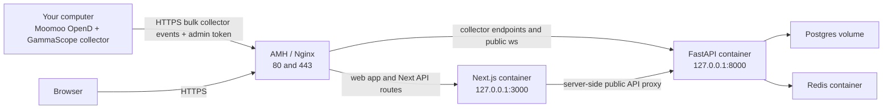

# AMH Nginx Server Setup Guide

This guide moves GammaScope from a local-only setup to a server layout where AMH/Nginx is public, FastAPI and Next.js run on the server, and your computer keeps running Moomoo OpenD plus the collector.

## Target Architecture



The server does not need Moomoo OpenD. Keep OpenD on the computer that has your licensed data session, then publish snapshots to the server API.

## What This Branch Adds

- `apps/api/Dockerfile`: production container for FastAPI plus collector modules.
- `apps/web/Dockerfile`: production container for Next.js with a build-time public WebSocket origin.
- `ops/amh-nginx/docker-compose.amh.yml`: server compose stack for Postgres, Redis, API, and web.
- `ops/amh-nginx/gammascope.nginx.conf`: full Nginx vhost template for AMH/manual Nginx.
- `ops/amh-nginx/gammascope.production.env.example`: server environment template.
- `ops/amh-nginx/gammascope.collector-client.env.example`: local collector environment template.
- `ops/amh-nginx/generate_secrets.py`: generates matching server and collector env files.
- `ops/amh-nginx/README.md`: condensed Debian deployment runbook.
- `services/collector/gammascope_collector/publisher.py`: collector publishing now reads `GAMMASCOPE_ADMIN_TOKEN` and sends `X-GammaScope-Admin-Token`.

## Sources Checked

- AMH official installation docs say AMH 7.3 should be installed on a clean Debian, CentOS, or Ubuntu server and supports Nginx-based environments: https://amh.sh/install.htm
- AMH official docs describe installing server/environment modules such as Nginx, LNMP/LNGX, and AMSSL from the panel: https://amh.sh/doc.htm
- Nginx official reverse proxy docs use `proxy_pass` and `proxy_set_header` to forward application requests: https://docs.nginx.com/nginx/admin-guide/web-server/reverse-proxy/
- Certbot official instructions recommend the snap-based Certbot install for Nginx on Linux and note that port 80 HTTP should already work before issuing the certificate: https://certbot.eff.org/instructions?ws=nginx&os=debianbuster
- Docker official Debian docs recommend installing Docker Engine from Docker's apt repository using `/etc/apt/sources.list.d/docker.sources`, then installing the Compose plugin package: https://docs.docker.com/engine/install/debian/

This guide also incorporates the live VPS setup notes from `gamma.hiqjj.org`: the server is Debian, Docker `hello-world` passed, the local Compose smoke tests passed, AMH/Nginx served the public app, and explicit `/_next/` proxying was needed to avoid static asset issues.

## Prerequisites

You need:

- A VPS with a clean supported Linux image. This guide is written for Debian 12/13 because the current server is Debian.
- AMH installed with an Nginx-based environment such as LNGX or LNMP.
- The domain `gamma.hiqjj.org`, with its DNS `A` record pointed at the server public IP.
- Cloud firewall/security group opened for `80/tcp` and `443/tcp`.
- SSH access to the server.
- Docker Engine and Docker Compose plugin on the server.
- Moomoo OpenD running on your own computer.

Do not open Postgres, Redis, FastAPI port `8000`, or Next.js port `3000` to the internet. The production compose file binds API and web to `127.0.0.1` only.

## 1. Prepare AMH and Nginx

Install AMH from the official AMH install page on a clean server. During AMH setup, choose an Nginx-capable environment. If AMH is already installed, install or enable:

- Nginx server software.
- LNGX or LNMP environment.
- AMSSL or another SSL certificate module if you want AMH to manage certificates.

In the server provider firewall, allow only:

```text
22/tcp    SSH, ideally locked to your IP
80/tcp    HTTP certificate challenge and redirect
443/tcp   HTTPS app
AMH panel port, only from your IP
```

Keep AMH's panel port restricted to your IP if the provider supports security group source IP rules.

## 2. Install Docker on the Debian Server

Follow Docker's official Debian repository instructions. If a previous Ubuntu-style command created `/etc/apt/sources.list.d/docker.list`, remove it first because one malformed APT source blocks every `apt-get update`.

```bash
set -eux

rm -f /etc/apt/sources.list.d/docker.list
rm -f /etc/apt/sources.list.d/docker.sources

apt-get update
apt-get install -y ca-certificates curl

. /etc/os-release
if [ "$ID" != "debian" ]; then
  echo "This block is for Debian only. Current OS: ID=$ID VERSION_CODENAME=$VERSION_CODENAME"
  exit 1
fi

install -m 0755 -d /etc/apt/keyrings
curl -fsSL https://download.docker.com/linux/debian/gpg -o /etc/apt/keyrings/docker.asc
chmod a+r /etc/apt/keyrings/docker.asc

cat > /etc/apt/sources.list.d/docker.sources <<EOF
Types: deb
URIs: https://download.docker.com/linux/debian
Suites: $VERSION_CODENAME
Components: stable
Architectures: $(dpkg --print-architecture)
Signed-By: /etc/apt/keyrings/docker.asc
EOF

cat /etc/apt/sources.list.d/docker.sources

apt-get update
apt-get install -y docker-ce docker-ce-cli containerd.io docker-buildx-plugin docker-compose-plugin

systemctl enable --now docker
docker version
docker compose version
docker run hello-world
```

Use `sudo docker ...` unless you intentionally add your SSH user to the `docker` group.

## 3. Put the Repo on the Server

Use `/opt/gammascope` for the app:

```bash
sudo mkdir -p /opt/gammascope
sudo chown "$USER":"$USER" /opt/gammascope
cd /opt/gammascope
```

If this branch has been pushed to GitHub:

```bash
git clone <your-github-repo-url> .
git fetch origin
git switch codex/amh-nginx-server-setup
```

If the branch has not been pushed yet, send it from your computer:

```bash
rsync -az --delete \
  --exclude .git \
  --exclude node_modules \
  --exclude .venv \
  --exclude .gammascope \
  /Users/sakura/WebstormProjects/gamma-scope/.worktrees/amh-nginx-server-setup/ \
  <ssh-user>@<server-ip>:/opt/gammascope/
```

## 4. Configure Server Secrets

Generate the production env file and a matching collector-client env file on the server:

```bash
cd /opt/gammascope
python3 ops/amh-nginx/generate_secrets.py \
  --server-output ops/amh-nginx/gammascope.production.env \
  --collector-output ops/amh-nginx/gammascope.collector-client.env
```

Save the printed web admin password and collector admin token. The generated env files are ignored by git.

`GAMMASCOPE_PUBLIC_ORIGIN` is compiled into the Next.js image. If you change the domain later, rebuild the web image.

If you pasted generated secrets somewhere public, rotate them. On a fresh test install, stop and remove the database volume first because regenerating the env also changes `GAMMASCOPE_POSTGRES_PASSWORD`:

```bash
docker compose \
  --env-file ops/amh-nginx/gammascope.production.env \
  -f ops/amh-nginx/docker-compose.amh.yml \
  down -v

python3 ops/amh-nginx/generate_secrets.py \
  --server-output ops/amh-nginx/gammascope.production.env \
  --collector-output ops/amh-nginx/gammascope.collector-client.env \
  --force
```

Do not use `down -v` after you have real production data unless you have a database backup. For a live database, keep the existing Postgres password or rotate it manually inside Postgres before changing the env file.

## 5. Start Backend and Frontend Containers

From `/opt/gammascope`:

```bash
docker compose \
  --env-file ops/amh-nginx/gammascope.production.env \
  -f ops/amh-nginx/docker-compose.amh.yml \
  up -d --build
```

Check status:

```bash
docker compose \
  --env-file ops/amh-nginx/gammascope.production.env \
  -f ops/amh-nginx/docker-compose.amh.yml \
  ps
```

Check local-only endpoints from the server:

```bash
curl -fsS http://127.0.0.1:3000/ >/dev/null && echo web-ok
curl -fsS http://127.0.0.1:8000/api/spx/0dte/replay/sessions | python3 -m json.tool
```

Useful logs:

```bash
docker compose --env-file ops/amh-nginx/gammascope.production.env -f ops/amh-nginx/docker-compose.amh.yml logs -f api
docker compose --env-file ops/amh-nginx/gammascope.production.env -f ops/amh-nginx/docker-compose.amh.yml logs -f web
```

## 6. Configure AMH/Nginx

There are two workable paths.

### Option A: AMH Panel Vhost

Use AMH to create a site/vhost for `gamma.hiqjj.org`, enable SSL with AMSSL, then add custom Nginx rules equivalent to these locations:

```nginx
location ^~ /_next/ {
    proxy_pass http://127.0.0.1:3000;
    proxy_http_version 1.1;
    proxy_set_header Host $host;
    proxy_set_header X-Real-IP $remote_addr;
    proxy_set_header X-Forwarded-For $proxy_add_x_forwarded_for;
    proxy_set_header X-Forwarded-Proto $scheme;
    proxy_read_timeout 3600;
    proxy_send_timeout 3600;
}

location ^~ /images/ {
    proxy_pass http://127.0.0.1:3000;
    proxy_http_version 1.1;
    proxy_set_header Host $host;
    proxy_set_header X-Real-IP $remote_addr;
    proxy_set_header X-Forwarded-For $proxy_add_x_forwarded_for;
    proxy_set_header X-Forwarded-Proto $scheme;
}

location = /favicon.ico {
    proxy_pass http://127.0.0.1:3000;
    proxy_http_version 1.1;
    proxy_set_header Host $host;
    proxy_set_header X-Real-IP $remote_addr;
    proxy_set_header X-Forwarded-For $proxy_add_x_forwarded_for;
    proxy_set_header X-Forwarded-Proto $scheme;
}

location ^~ /api/admin/ {
    proxy_pass http://127.0.0.1:3000;
    proxy_http_version 1.1;
    proxy_set_header Host $host;
    proxy_set_header X-Real-IP $remote_addr;
    proxy_set_header X-Forwarded-For $proxy_add_x_forwarded_for;
    proxy_set_header X-Forwarded-Proto $scheme;
}

location ^~ /api/replay/imports {
    proxy_pass http://127.0.0.1:3000;
    proxy_http_version 1.1;
    proxy_set_header Host $host;
    proxy_set_header X-Real-IP $remote_addr;
    proxy_set_header X-Forwarded-For $proxy_add_x_forwarded_for;
    proxy_set_header X-Forwarded-Proto $scheme;
}

location = /api/views {
    proxy_pass http://127.0.0.1:3000;
    proxy_http_version 1.1;
    proxy_set_header Host $host;
    proxy_set_header X-Real-IP $remote_addr;
    proxy_set_header X-Forwarded-For $proxy_add_x_forwarded_for;
    proxy_set_header X-Forwarded-Proto $scheme;
}

location = /api/spx/0dte/snapshot/latest {
    proxy_pass http://127.0.0.1:3000;
    proxy_http_version 1.1;
    proxy_set_header Host $host;
    proxy_set_header X-Real-IP $remote_addr;
    proxy_set_header X-Forwarded-For $proxy_add_x_forwarded_for;
    proxy_set_header X-Forwarded-Proto $scheme;
}

location = /api/spx/0dte/status {
    proxy_pass http://127.0.0.1:3000;
    proxy_http_version 1.1;
    proxy_set_header Host $host;
    proxy_set_header X-Real-IP $remote_addr;
    proxy_set_header X-Forwarded-For $proxy_add_x_forwarded_for;
    proxy_set_header X-Forwarded-Proto $scheme;
}

location = /api/spx/0dte/heatmap/latest {
    proxy_pass http://127.0.0.1:3000;
    proxy_http_version 1.1;
    proxy_set_header Host $host;
    proxy_set_header X-Real-IP $remote_addr;
    proxy_set_header X-Forwarded-For $proxy_add_x_forwarded_for;
    proxy_set_header X-Forwarded-Proto $scheme;
}

location ^~ /api/spx/0dte/experimental/ {
    proxy_pass http://127.0.0.1:3000;
    proxy_http_version 1.1;
    proxy_set_header Host $host;
    proxy_set_header X-Real-IP $remote_addr;
    proxy_set_header X-Forwarded-For $proxy_add_x_forwarded_for;
    proxy_set_header X-Forwarded-Proto $scheme;
}

location ^~ /api/spx/0dte/replay/ {
    proxy_pass http://127.0.0.1:3000;
    proxy_http_version 1.1;
    proxy_set_header Host $host;
    proxy_set_header X-Real-IP $remote_addr;
    proxy_set_header X-Forwarded-For $proxy_add_x_forwarded_for;
    proxy_set_header X-Forwarded-Proto $scheme;
}

location = /api/spx/0dte/scenario {
    proxy_pass http://127.0.0.1:3000;
    proxy_http_version 1.1;
    proxy_set_header Host $host;
    proxy_set_header X-Real-IP $remote_addr;
    proxy_set_header X-Forwarded-For $proxy_add_x_forwarded_for;
    proxy_set_header X-Forwarded-Proto $scheme;
}

location = /api/spx/0dte/collector/events {
    proxy_pass http://127.0.0.1:8000;
    proxy_http_version 1.1;
    proxy_set_header Host $host;
    proxy_set_header X-Real-IP $remote_addr;
    proxy_set_header X-Forwarded-For $proxy_add_x_forwarded_for;
    proxy_set_header X-Forwarded-Proto $scheme;
    proxy_read_timeout 30s;
    proxy_send_timeout 30s;
}

location = /api/spx/0dte/collector/events/bulk {
    proxy_pass http://127.0.0.1:8000;
    proxy_http_version 1.1;
    proxy_set_header Host $host;
    proxy_set_header X-Real-IP $remote_addr;
    proxy_set_header X-Forwarded-For $proxy_add_x_forwarded_for;
    proxy_set_header X-Forwarded-Proto $scheme;
    proxy_read_timeout 60s;
    proxy_send_timeout 60s;
}

location ^~ /ws/ {
    proxy_pass http://127.0.0.1:8000;
    proxy_http_version 1.1;
    proxy_set_header Upgrade $http_upgrade;
    proxy_set_header Connection "upgrade";
    proxy_set_header Host $host;
    proxy_set_header X-Real-IP $remote_addr;
    proxy_set_header X-Forwarded-For $proxy_add_x_forwarded_for;
    proxy_set_header X-Forwarded-Proto $scheme;
    proxy_read_timeout 1h;
    proxy_send_timeout 1h;
    proxy_buffering off;
}

location / {
    proxy_pass http://127.0.0.1:3000;
    proxy_http_version 1.1;
    proxy_set_header Upgrade $http_upgrade;
    proxy_set_header Connection "upgrade";
    proxy_set_header Host $host;
    proxy_set_header X-Real-IP $remote_addr;
    proxy_set_header X-Forwarded-For $proxy_add_x_forwarded_for;
    proxy_set_header X-Forwarded-Proto $scheme;
    proxy_read_timeout 60s;
    proxy_send_timeout 60s;
    proxy_buffering off;
}
```

Do not add a broad `/api/ -> 127.0.0.1:8000` rule in AMH. Next.js owns routes such as `/api/admin/login` and the authenticated realtime proxy at `/api/spx/0dte/snapshot/latest`; broad API proxying will make private-mode browser pages keep seeing seed data.

Use this option when AMH owns certificate renewal and vhost generation.

### Option B: Full Nginx Template

Copy the repo template. It already uses `gamma.hiqjj.org` and the matching Let's Encrypt certificate paths:

```bash
sudo cp /opt/gammascope/ops/amh-nginx/gammascope.nginx.conf /etc/nginx/conf.d/gammascope.conf
```

If your AMH Nginx is not using `/etc/nginx/conf.d`, locate its active config:

```bash
sudo nginx -T 2>/dev/null | grep -n "include .*conf"
```

Then place the file in an included directory, or paste the server blocks into the AMH-managed custom config area.

Validate and reload:

```bash
sudo nginx -t
sudo systemctl reload nginx || sudo systemctl restart nginx
```

## 7. Configure HTTPS

If AMH/AMSSL handles HTTPS, issue the certificate there and make sure the Nginx vhost points at that certificate.

If using Certbot directly on Debian:

```bash
sudo apt-get update
sudo apt-get install -y snapd
sudo systemctl enable --now snapd.socket
sudo snap install core
sudo snap refresh core
sudo snap install --classic certbot
sudo ln -sf /snap/bin/certbot /usr/local/bin/certbot
sudo certbot --nginx -d gamma.hiqjj.org
sudo certbot renew --dry-run
```

Certbot expects your domain to already resolve to the server and port `80` to be reachable.

## 8. Smoke Test the Public Server

From your computer:

```bash
curl -I https://gamma.hiqjj.org/
curl -fsS https://gamma.hiqjj.org/api/spx/0dte/replay/sessions | python3 -m json.tool
```

Verify that AMH is not intercepting Next.js assets:

```bash
ASSET_PATH="$(curl -fsS https://gamma.hiqjj.org/ | grep -oE '/_next/[^"]+' | head -1)"
echo "$ASSET_PATH"
curl -I "https://gamma.hiqjj.org$ASSET_PATH"
```

Expected: `HTTP/2 200` and a Next static asset content type such as CSS or JavaScript.

Collector ingestion should require the admin token:

```bash
curl -i -X POST https://gamma.hiqjj.org/api/spx/0dte/collector/events/bulk \
  -H 'Content-Type: application/json' \
  --data '[]'
```

Expected without token: `403`.

With the token:

```bash
curl -i -X POST https://gamma.hiqjj.org/api/spx/0dte/collector/events/bulk \
  -H "X-GammaScope-Admin-Token: <your-admin-token>" \
  -H 'Content-Type: application/json' \
  --data '[]'
```

Expected with an empty batch: `200` and `accepted_count: 0`.

## 9. Configure Your Computer as the Collector Client

On your computer, from the GammaScope repo:

```bash
cp ops/amh-nginx/gammascope.collector-client.env.example ops/amh-nginx/gammascope.collector-client.env
```

Edit it:

```text
GAMMASCOPE_SERVER_API=https://gamma.hiqjj.org
GAMMASCOPE_ADMIN_TOKEN=<same server admin token>
GAMMASCOPE_MOOMOO_HOST=127.0.0.1
GAMMASCOPE_MOOMOO_PORT=11111
GAMMASCOPE_RUT_SPOT=2050
GAMMASCOPE_NDX_SPOT=18300
```

Load it into your shell:

```bash
set -a
. ops/amh-nginx/gammascope.collector-client.env
set +a
```

Make sure Moomoo OpenD is running locally, then run a one-loop smoke publish:

```bash
pnpm collector:moomoo-snapshot -- \
  --host "$GAMMASCOPE_MOOMOO_HOST" \
  --port "$GAMMASCOPE_MOOMOO_PORT" \
  --api "$GAMMASCOPE_SERVER_API" \
  --spot RUT="$GAMMASCOPE_RUT_SPOT" \
  --spot NDX="$GAMMASCOPE_NDX_SPOT" \
  --max-loops 1 \
  --publish
```

Then run continuously:

```bash
pnpm collector:moomoo-snapshot -- \
  --host "$GAMMASCOPE_MOOMOO_HOST" \
  --port "$GAMMASCOPE_MOOMOO_PORT" \
  --api "$GAMMASCOPE_SERVER_API" \
  --spot RUT="$GAMMASCOPE_RUT_SPOT" \
  --spot NDX="$GAMMASCOPE_NDX_SPOT" \
  --publish
```

Because this branch updates the publisher, the collector automatically reads `GAMMASCOPE_ADMIN_TOKEN` from the environment and sends it as `X-GammaScope-Admin-Token`.

## 10. Confirm Server Data

On the server:

```bash
docker compose --env-file ops/amh-nginx/gammascope.production.env -f ops/amh-nginx/docker-compose.amh.yml exec postgres \
  psql -U gammascope -d gammascope -c "
    select session_id, symbol, snapshot_count, end_time
    from replay_sessions
    where session_id like 'moomoo-%-0dte-live'
    order by session_id;
  "
```

From your computer:

```bash
curl -fsS "https://gamma.hiqjj.org/api/spx/0dte/heatmap/latest?metric=gex&symbol=SPX" | python3 -m json.tool
```

Open:

```text
https://gamma.hiqjj.org/
https://gamma.hiqjj.org/heatmap
```

Live dashboard viewing is public. The web admin login is only needed for replay import/upload flows; collector ingestion and maintenance commands still require the generated admin token.

## 11. Operating Commands

Rebuild after code changes:

```bash
cd /opt/gammascope
git pull
docker compose --env-file ops/amh-nginx/gammascope.production.env -f ops/amh-nginx/docker-compose.amh.yml up -d --build
```

Restart:

```bash
docker compose --env-file ops/amh-nginx/gammascope.production.env -f ops/amh-nginx/docker-compose.amh.yml restart
```

Stop:

```bash
docker compose --env-file ops/amh-nginx/gammascope.production.env -f ops/amh-nginx/docker-compose.amh.yml down
```

Backup Postgres:

```bash
docker compose --env-file ops/amh-nginx/gammascope.production.env -f ops/amh-nginx/docker-compose.amh.yml exec postgres \
  pg_dump -U gammascope gammascope > "gammascope-$(date +%Y%m%d-%H%M%S).sql"
```

## Troubleshooting

If the site does not load, run `curl -I http://127.0.0.1:3000/` on the server. If local curl works, the problem is Nginx/AMH. If local curl fails, inspect `docker compose ... logs web`.

If collector publish returns `403`, the computer's `GAMMASCOPE_ADMIN_TOKEN` does not match the server's `GAMMASCOPE_ADMIN_TOKEN`, or the server was not restarted after changing the env file.

If collector publish cannot connect, check DNS, HTTPS, firewall, and the Nginx collector locations. The collector should publish to the public origin, not to `127.0.0.1`.

If the browser live WebSocket is unavailable, check the AMH `/ws/` reverse proxy rule. Live dashboard viewing is public, so a missing admin login should not block realtime data.

If AMH overwrites manual Nginx edits, move the custom locations into AMH's supported custom vhost/rules field or keep a copy of `ops/amh-nginx/gammascope.nginx.conf` and re-apply after AMH regenerates configs.
