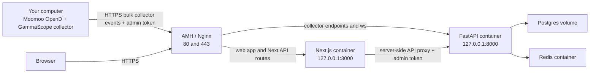

# AMH Nginx Server Setup Guide

This guide moves GammaScope from a local-only setup to a server layout where AMH/Nginx is public, FastAPI and Next.js run on the server, and your computer keeps running Moomoo OpenD plus the collector.

## Target Architecture



The server does not need Moomoo OpenD. Keep OpenD on the computer that has your licensed data session, then publish snapshots to the server API.

## What This Branch Adds

- `apps/api/Dockerfile`: production container for FastAPI plus collector modules.
- `apps/web/Dockerfile`: production container for Next.js with a build-time public WebSocket origin.
- `ops/amh-nginx/docker-compose.amh.yml`: server compose stack for Postgres, Redis, API, and web.
- `ops/amh-nginx/gammascope.nginx.conf`: full Nginx vhost template for AMH/manual Nginx.
- `ops/amh-nginx/gammascope.production.env.example`: server environment template.
- `ops/amh-nginx/gammascope.collector-client.env.example`: local collector environment template.
- `services/collector/gammascope_collector/publisher.py`: collector publishing now reads `GAMMASCOPE_ADMIN_TOKEN` and sends `X-GammaScope-Admin-Token`.

## Sources Checked

- AMH official installation docs say AMH 7.3 should be installed on a clean Debian, CentOS, or Ubuntu server and supports Nginx-based environments: https://amh.sh/install.htm
- AMH official docs describe installing server/environment modules such as Nginx, LNMP/LNGX, and AMSSL from the panel: https://amh.sh/doc.htm
- Nginx official reverse proxy docs use `proxy_pass` and `proxy_set_header` to forward application requests: https://docs.nginx.com/nginx/admin-guide/web-server/reverse-proxy/
- Certbot official instructions recommend the snap-based Certbot install for Nginx on Ubuntu and note that port 80 HTTP should already work before issuing the certificate: https://certbot.eff.org/instructions?ws=nginx&os=ubuntufocal
- Docker official docs recommend installing Docker Engine from Docker's apt repository and using the Compose plugin on Linux: https://docs.docker.com/engine/install/ubuntu/ and https://docs.docker.com/compose/install/linux/

I could open the shared ChatGPT URL, but the shared page did not expose the actual chat content without login in this environment. This guide is based on the repo and primary docs above.

## Prerequisites

You need:

- A VPS with a clean supported Linux image. Ubuntu 24.04 LTS is the most straightforward choice.
- AMH installed with an Nginx-based environment such as LNGX or LNMP.
- A domain or subdomain, for example `gammascope.example.com`.
- DNS `A` record pointing that domain to the server public IP.
- Cloud firewall/security group opened for `80/tcp` and `443/tcp`.
- SSH access to the server.
- Docker Engine and Docker Compose plugin on the server.
- Moomoo OpenD running on your own computer.

Do not open Postgres, Redis, FastAPI port `8000`, or Next.js port `3000` to the internet. The production compose file binds API and web to `127.0.0.1` only.

## 1. Prepare AMH and Nginx

Install AMH from the official AMH install page on a clean server. During AMH setup, choose an Nginx-capable environment. If AMH is already installed, install or enable:

- Nginx server software.
- LNGX or LNMP environment.
- AMSSL or another SSL certificate module if you want AMH to manage certificates.

In the server provider firewall, allow only:

```text
22/tcp    SSH, ideally locked to your IP
80/tcp    HTTP certificate challenge and redirect
443/tcp   HTTPS app
AMH panel port, only from your IP
```

Keep AMH's panel port restricted to your IP if the provider supports security group source IP rules.

## 2. Install Docker on the Server

Follow Docker's official Ubuntu repository instructions. The short version for Ubuntu is:

```bash
sudo apt-get update
sudo apt-get install -y ca-certificates curl
sudo install -m 0755 -d /etc/apt/keyrings
sudo curl -fsSL https://download.docker.com/linux/ubuntu/gpg -o /etc/apt/keyrings/docker.asc
sudo chmod a+r /etc/apt/keyrings/docker.asc

echo \
  "deb [arch=$(dpkg --print-architecture) signed-by=/etc/apt/keyrings/docker.asc] https://download.docker.com/linux/ubuntu \
  $(. /etc/os-release && echo "${UBUNTU_CODENAME:-$VERSION_CODENAME}") stable" \
  | sudo tee /etc/apt/sources.list.d/docker.list > /dev/null

sudo apt-get update
sudo apt-get install -y docker-ce docker-ce-cli containerd.io docker-buildx-plugin docker-compose-plugin
sudo docker run hello-world
docker compose version
```

Use `sudo docker ...` unless you intentionally add your SSH user to the `docker` group.

## 3. Put the Repo on the Server

Use `/opt/gammascope` for the app:

```bash
sudo mkdir -p /opt/gammascope
sudo chown "$USER":"$USER" /opt/gammascope
cd /opt/gammascope
```

If this branch has been pushed to GitHub:

```bash
git clone <your-github-repo-url> .
git fetch origin
git switch codex/amh-nginx-server-setup
```

If the branch has not been pushed yet, send it from your computer:

```bash
rsync -az --delete \
  --exclude .git \
  --exclude node_modules \
  --exclude .venv \
  --exclude .gammascope \
  /Users/sakura/WebstormProjects/gamma-scope/.worktrees/amh-nginx-server-setup/ \
  <ssh-user>@<server-ip>:/opt/gammascope/
```

## 4. Configure Server Secrets

Create the production env file on the server:

```bash
cd /opt/gammascope
cp ops/amh-nginx/gammascope.production.env.example ops/amh-nginx/gammascope.production.env
```

Generate secrets:

```bash
openssl rand -hex 24
openssl rand -hex 32
openssl rand -base64 48 | tr -d '\n' && echo
```

Edit `ops/amh-nginx/gammascope.production.env`:

```text
GAMMASCOPE_PUBLIC_ORIGIN=https://gammascope.example.com
GAMMASCOPE_POSTGRES_PASSWORD=<random database password>
GAMMASCOPE_ADMIN_TOKEN=<random admin token shared only with your collector and server-side web process>
GAMMASCOPE_WEB_ADMIN_PASSWORD=<random web login password>
GAMMASCOPE_WEB_ADMIN_SESSION_SECRET=<at least 32 random chars>
```

`GAMMASCOPE_PUBLIC_ORIGIN` is compiled into the Next.js image. If you change the domain later, rebuild the web image.

## 5. Start Backend and Frontend Containers

From `/opt/gammascope`:

```bash
docker compose \
  --env-file ops/amh-nginx/gammascope.production.env \
  -f ops/amh-nginx/docker-compose.amh.yml \
  up -d --build
```

Check status:

```bash
docker compose \
  --env-file ops/amh-nginx/gammascope.production.env \
  -f ops/amh-nginx/docker-compose.amh.yml \
  ps
```

Check local-only endpoints from the server:

```bash
curl -fsS http://127.0.0.1:3000/ >/dev/null && echo web-ok
curl -fsS http://127.0.0.1:8000/api/spx/0dte/replay/sessions | python3 -m json.tool
```

Useful logs:

```bash
docker compose --env-file ops/amh-nginx/gammascope.production.env -f ops/amh-nginx/docker-compose.amh.yml logs -f api
docker compose --env-file ops/amh-nginx/gammascope.production.env -f ops/amh-nginx/docker-compose.amh.yml logs -f web
```

## 6. Configure AMH/Nginx

There are two workable paths.

### Option A: AMH Panel Vhost

Use AMH to create a site/vhost for `gammascope.example.com`, enable SSL with AMSSL, then add custom Nginx rules equivalent to these locations:

```nginx
location = /api/spx/0dte/collector/events {
    proxy_pass http://127.0.0.1:8000;
    proxy_set_header Host $host;
    proxy_set_header X-Real-IP $remote_addr;
    proxy_set_header X-Forwarded-For $proxy_add_x_forwarded_for;
    proxy_set_header X-Forwarded-Proto $scheme;
    proxy_read_timeout 30s;
    proxy_send_timeout 30s;
}

location = /api/spx/0dte/collector/events/bulk {
    proxy_pass http://127.0.0.1:8000;
    proxy_set_header Host $host;
    proxy_set_header X-Real-IP $remote_addr;
    proxy_set_header X-Forwarded-For $proxy_add_x_forwarded_for;
    proxy_set_header X-Forwarded-Proto $scheme;
    proxy_read_timeout 60s;
    proxy_send_timeout 60s;
}

location ^~ /ws/ {
    proxy_pass http://127.0.0.1:8000;
    proxy_http_version 1.1;
    proxy_set_header Upgrade $http_upgrade;
    proxy_set_header Connection "upgrade";
    proxy_set_header Host $host;
    proxy_set_header X-Real-IP $remote_addr;
    proxy_set_header X-Forwarded-For $proxy_add_x_forwarded_for;
    proxy_set_header X-Forwarded-Proto $scheme;
    proxy_read_timeout 1h;
    proxy_send_timeout 1h;
    proxy_buffering off;
}

location / {
    proxy_pass http://127.0.0.1:3000;
    proxy_http_version 1.1;
    proxy_set_header Upgrade $http_upgrade;
    proxy_set_header Connection "upgrade";
    proxy_set_header Host $host;
    proxy_set_header X-Real-IP $remote_addr;
    proxy_set_header X-Forwarded-For $proxy_add_x_forwarded_for;
    proxy_set_header X-Forwarded-Proto $scheme;
    proxy_read_timeout 60s;
    proxy_send_timeout 60s;
    proxy_buffering off;
}
```

Use this option when AMH owns certificate renewal and vhost generation.

### Option B: Full Nginx Template

Copy the repo template and edit the domain/certificate paths:

```bash
sudo cp /opt/gammascope/ops/amh-nginx/gammascope.nginx.conf /etc/nginx/conf.d/gammascope.conf
sudo sed -i 's/gammascope.example.com/your-real-domain.example/g' /etc/nginx/conf.d/gammascope.conf
```

If your AMH Nginx is not using `/etc/nginx/conf.d`, locate its active config:

```bash
sudo nginx -T 2>/dev/null | grep -n "include .*conf"
```

Then place the file in an included directory, or paste the server blocks into the AMH-managed custom config area.

Validate and reload:

```bash
sudo nginx -t
sudo nginx -s reload
```

## 7. Configure HTTPS

If AMH/AMSSL handles HTTPS, issue the certificate there and make sure the Nginx vhost points at that certificate.

If using Certbot directly on Ubuntu:

```bash
sudo snap install --classic certbot
sudo ln -sf /snap/bin/certbot /usr/bin/certbot
sudo certbot --nginx -d gammascope.example.com
sudo certbot renew --dry-run
```

Certbot expects your domain to already resolve to the server and port `80` to be reachable.

## 8. Smoke Test the Public Server

From your computer:

```bash
curl -I https://gammascope.example.com/
curl -fsS https://gammascope.example.com/api/spx/0dte/replay/sessions | python3 -m json.tool
```

Collector ingestion should require the admin token:

```bash
curl -i -X POST https://gammascope.example.com/api/spx/0dte/collector/events/bulk \
  -H 'Content-Type: application/json' \
  --data '[]'
```

Expected without token: `403`.

With the token:

```bash
curl -i -X POST https://gammascope.example.com/api/spx/0dte/collector/events/bulk \
  -H "X-GammaScope-Admin-Token: <your-admin-token>" \
  -H 'Content-Type: application/json' \
  --data '[]'
```

Expected with an empty batch: `200` and `accepted_count: 0`.

## 9. Configure Your Computer as the Collector Client

On your computer, from the GammaScope repo:

```bash
cp ops/amh-nginx/gammascope.collector-client.env.example ops/amh-nginx/gammascope.collector-client.env
```

Edit it:

```text
GAMMASCOPE_SERVER_API=https://gammascope.example.com
GAMMASCOPE_ADMIN_TOKEN=<same server admin token>
GAMMASCOPE_MOOMOO_HOST=127.0.0.1
GAMMASCOPE_MOOMOO_PORT=11111
GAMMASCOPE_RUT_SPOT=2050
GAMMASCOPE_NDX_SPOT=18300
```

Load it into your shell:

```bash
set -a
. ops/amh-nginx/gammascope.collector-client.env
set +a
```

Make sure Moomoo OpenD is running locally, then run a one-loop smoke publish:

```bash
pnpm collector:moomoo-snapshot -- \
  --host "$GAMMASCOPE_MOOMOO_HOST" \
  --port "$GAMMASCOPE_MOOMOO_PORT" \
  --api "$GAMMASCOPE_SERVER_API" \
  --spot RUT="$GAMMASCOPE_RUT_SPOT" \
  --spot NDX="$GAMMASCOPE_NDX_SPOT" \
  --max-loops 1 \
  --publish
```

Then run continuously:

```bash
pnpm collector:moomoo-snapshot -- \
  --host "$GAMMASCOPE_MOOMOO_HOST" \
  --port "$GAMMASCOPE_MOOMOO_PORT" \
  --api "$GAMMASCOPE_SERVER_API" \
  --spot RUT="$GAMMASCOPE_RUT_SPOT" \
  --spot NDX="$GAMMASCOPE_NDX_SPOT" \
  --publish
```

Because this branch updates the publisher, the collector automatically reads `GAMMASCOPE_ADMIN_TOKEN` from the environment and sends it as `X-GammaScope-Admin-Token`.

## 10. Confirm Server Data

On the server:

```bash
docker compose --env-file ops/amh-nginx/gammascope.production.env -f ops/amh-nginx/docker-compose.amh.yml exec postgres \
  psql -U gammascope -d gammascope -c "
    select session_id, symbol, snapshot_count, end_time
    from replay_sessions
    where session_id like 'moomoo-%-0dte-live'
    order by session_id;
  "
```

From your computer:

```bash
curl -fsS "https://gammascope.example.com/api/spx/0dte/heatmap/latest?metric=gex&symbol=SPX" | python3 -m json.tool
```

Open:

```text
https://gammascope.example.com/
https://gammascope.example.com/heatmap
```

## 11. Operating Commands

Rebuild after code changes:

```bash
cd /opt/gammascope
git pull
docker compose --env-file ops/amh-nginx/gammascope.production.env -f ops/amh-nginx/docker-compose.amh.yml up -d --build
```

Restart:

```bash
docker compose --env-file ops/amh-nginx/gammascope.production.env -f ops/amh-nginx/docker-compose.amh.yml restart
```

Stop:

```bash
docker compose --env-file ops/amh-nginx/gammascope.production.env -f ops/amh-nginx/docker-compose.amh.yml down
```

Backup Postgres:

```bash
docker compose --env-file ops/amh-nginx/gammascope.production.env -f ops/amh-nginx/docker-compose.amh.yml exec postgres \
  pg_dump -U gammascope gammascope > "gammascope-$(date +%Y%m%d-%H%M%S).sql"
```

## Troubleshooting

If the site does not load, run `curl -I http://127.0.0.1:3000/` on the server. If local curl works, the problem is Nginx/AMH. If local curl fails, inspect `docker compose ... logs web`.

If collector publish returns `403`, the computer's `GAMMASCOPE_ADMIN_TOKEN` does not match the server's `GAMMASCOPE_ADMIN_TOKEN`, or the server was not restarted after changing the env file.

If collector publish cannot connect, check DNS, HTTPS, firewall, and the Nginx collector locations. The collector should publish to the public origin, not to `127.0.0.1`.

If the browser live WebSocket is unavailable in private mode, that is expected unless the browser has an admin token. The web app's server-side API routes can still fetch live data using the server-side `GAMMASCOPE_ADMIN_TOKEN`, and the dashboard should fall back to polling.

If AMH overwrites manual Nginx edits, move the custom locations into AMH's supported custom vhost/rules field or keep a copy of `ops/amh-nginx/gammascope.nginx.conf` and re-apply after AMH regenerates configs.
