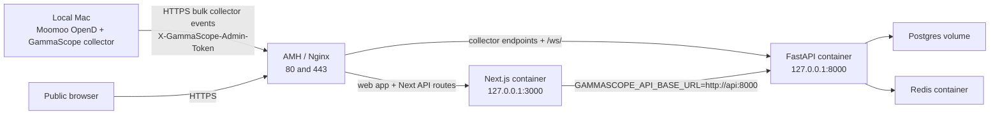

# GammaScope Production Deployment

This is the canonical deployment runbook for the working `gamma.hiqjj.org` setup.

It captures the server layout, AMH/Nginx routing, Docker Compose stack, local Moomoo collector, operational commands, and smoke tests used to get the current deployment working. It intentionally does not contain passwords, tokens, SSH passwords, or generated secrets.

## Quick Start

Use this when redeploying the same `gamma.hiqjj.org` shape. These commands do not contain credentials. On the first server run, the bootstrap script generates secrets and prints the web admin password plus collector token once; save those privately.

Server, from your Mac:

```bash
ssh root@149.56.14.95 'curl -fsSL https://raw.githubusercontent.com/zifanzhou1024/gamma-scope/main/ops/amh-nginx/bootstrap_gamma_server.sh | bash'
```

Local Moomoo collector, from your Mac repo checkout after Moomoo OpenD is running:

```bash
cd /Users/sakura/WebstormProjects/gamma-scope/.worktrees/amh-nginx-server-setup && mkdir -p ops/amh-nginx && scp root@gamma.hiqjj.org:/opt/gammascope/ops/amh-nginx/gammascope.collector-client.env ops/amh-nginx/gammascope.collector-client.env && chmod 600 ops/amh-nginx/gammascope.collector-client.env && bash ops/amh-nginx/start_moomoo_collector_mac.sh
```

If this is a brand-new AMH vhost, paste the `gamma.hiqjj.org` URL rule blocks from `/opt/gammascope/ops/amh-nginx/README.md` into AMH's `gamma.conf` once, then reload:

```bash
/usr/local/nginx-1.24/sbin/nginx -t && /usr/local/nginx-1.24/sbin/nginx -s reload
```

Fast public checks:

```bash
curl -I https://gamma.hiqjj.org/ && curl -fsS https://gamma.hiqjj.org/api/spx/0dte/snapshot/latest
```

## Current Production Shape

Use these values for the current deployment unless you are intentionally creating a new environment:

```text
Public domain:         gamma.hiqjj.org
Server SSH target:     root@149.56.14.95 or root@gamma.hiqjj.org
Server app path:       /opt/gammascope
GitHub repo:           https://github.com/zifanzhou1024/gamma-scope.git
Deployment branch:     main
Server OS:             Debian
Public reverse proxy:  AMH Nginx
API container port:    127.0.0.1:8000
Web container port:    127.0.0.1:3000
Collector machine:     local Mac with Moomoo OpenD on 127.0.0.1:11111
```

Access policy:

- Public visitors can view the live dashboard, live heatmap, replay, experimental pages, and live WebSocket data without logging in.
- The web admin login is for replay import/upload and future admin-only actions.
- Collector ingestion, raw collector state, replay import mutation, and maintenance endpoints still require `GAMMASCOPE_ADMIN_TOKEN`.
- Never commit `gammascope.production.env`, `gammascope.collector-client.env`, database dumps, replay parquet files, or raw licensed market data.

## Architecture



The server does not need Moomoo OpenD. Keep OpenD on the computer that has the licensed Moomoo data session, then publish snapshots to the public server API.

## Files That Matter

```text
docs/deployment.md                              This runbook
docs/amh-nginx-server-setup.md                  Longer AMH setup notes
ops/amh-nginx/README.md                         Condensed AMH runbook with pasteable location blocks
ops/amh-nginx/docker-compose.amh.yml            Server Compose stack
ops/amh-nginx/gammascope.nginx.conf             Full Nginx vhost template
ops/amh-nginx/generate_secrets.py               Env/secret generator
ops/amh-nginx/bootstrap_gamma_server.sh         One-command server bootstrap
ops/amh-nginx/start_moomoo_collector_mac.sh     One-command local collector starter
ops/amh-nginx/gammascope.production.env.example Server env template
ops/amh-nginx/gammascope.collector-client.env.example Local collector env template
```

Generated files are ignored by Git:

```text
ops/amh-nginx/gammascope.production.env
ops/amh-nginx/gammascope.collector-client.env
```

## 1. DNS, Firewall, and AMH

DNS should point the subdomain at the VPS:

```text
Type: A
Name: gamma
Value: 149.56.14.95
TTL: Auto or 300
```

Verify DNS:

```bash
dig +short gamma.hiqjj.org
```

Expected:

```text
149.56.14.95
```

Firewall rules:

```text
22/tcp       SSH, preferably restricted to your IP
80/tcp       HTTP certificate challenge and redirect
443/tcp      HTTPS app
AMH panel    only from trusted IPs
```

Do not expose Postgres, Redis, `8000`, or `3000` publicly. The Compose file binds API and web to localhost.

In AMH, create a site/vhost for:

```text
gamma.hiqjj.org
```

Enable SSL in AMH/AMSSL for that vhost. The site root can remain AMH's default generated web root because Nginx proxies requests to Docker.

## 2. Install Docker on Debian

Run as `root` on the VPS. This block also fixes the earlier failure mode where an Ubuntu Docker repo line was accidentally added to a Debian system.

```bash
set -eux

rm -f /etc/apt/sources.list.d/docker.list
rm -f /etc/apt/sources.list.d/docker.sources

apt-get update
apt-get install -y ca-certificates curl git openssl python3

. /etc/os-release
test "$ID" = "debian"

install -m 0755 -d /etc/apt/keyrings
curl -fsSL https://download.docker.com/linux/debian/gpg -o /etc/apt/keyrings/docker.asc
chmod a+r /etc/apt/keyrings/docker.asc

cat > /etc/apt/sources.list.d/docker.sources <<EOF
Types: deb
URIs: https://download.docker.com/linux/debian
Suites: $VERSION_CODENAME
Components: stable
Architectures: $(dpkg --print-architecture)
Signed-By: /etc/apt/keyrings/docker.asc
EOF

cat /etc/apt/sources.list.d/docker.sources

apt-get update
apt-get install -y docker-ce docker-ce-cli containerd.io docker-buildx-plugin docker-compose-plugin
systemctl enable --now docker

docker version
docker compose version
docker run hello-world
```

If APT reports `Malformed entry ... /etc/apt/sources.list.d/docker.list`, delete that file and recreate `docker.sources` with the Debian block above.

## 3. Clone or Update the Repo on the Server

Fresh install:

```bash
mkdir -p /opt/gammascope
cd /opt/gammascope

git clone https://github.com/zifanzhou1024/gamma-scope.git .
git fetch origin
git switch main
```

Existing install:

```bash
cd /opt/gammascope
git fetch origin
git switch main
git pull --ff-only
```

Check the branch:

```bash
git branch --show-current
git log -1 --oneline
```

## 4. Generate Server and Collector Env Files

Generate matching server and collector env files:

```bash
cd /opt/gammascope

python3 ops/amh-nginx/generate_secrets.py \
  --domain gamma.hiqjj.org \
  --server-output ops/amh-nginx/gammascope.production.env \
  --collector-output ops/amh-nginx/gammascope.collector-client.env
```

Save the printed values privately:

```text
web admin username
web admin password
collector admin token
```

Do not paste those values into chat, screenshots, issues, logs, or GitHub.

The generated server env contains:

```text
GAMMASCOPE_PUBLIC_ORIGIN=https://gamma.hiqjj.org
GAMMASCOPE_POSTGRES_DB=gammascope
GAMMASCOPE_POSTGRES_USER=gammascope
GAMMASCOPE_POSTGRES_PASSWORD=<generated>
GAMMASCOPE_PRIVATE_MODE_ENABLED=true
GAMMASCOPE_ADMIN_TOKEN=<generated>
GAMMASCOPE_WEB_ADMIN_USERNAME=admin
GAMMASCOPE_WEB_ADMIN_PASSWORD=<generated>
GAMMASCOPE_WEB_ADMIN_SESSION_SECRET=<generated>
GAMMASCOPE_API_HOST_PORT=8000
GAMMASCOPE_WEB_HOST_PORT=3000
GAMMASCOPE_REPLAY_CAPTURE_INTERVAL_SECONDS=5
GAMMASCOPE_REPLAY_RETENTION_DAYS=20
GAMMASCOPE_SAVED_VIEW_RETENTION_DAYS=90
GAMMASCOPE_REPLAY_IMPORT_MAX_BYTES=104857600
```

The generated collector env contains:

```text
GAMMASCOPE_SERVER_API=https://gamma.hiqjj.org
GAMMASCOPE_ADMIN_TOKEN=<same generated admin token>
GAMMASCOPE_MOOMOO_HOST=127.0.0.1
GAMMASCOPE_MOOMOO_PORT=11111
GAMMASCOPE_RUT_SPOT=2050
GAMMASCOPE_NDX_SPOT=18300
```

If you are rotating secrets on a fresh test install, remove the old database volume first:

```bash
cd /opt/gammascope

docker compose \
  --env-file ops/amh-nginx/gammascope.production.env \
  -f ops/amh-nginx/docker-compose.amh.yml \
  down -v

python3 ops/amh-nginx/generate_secrets.py \
  --domain gamma.hiqjj.org \
  --server-output ops/amh-nginx/gammascope.production.env \
  --collector-output ops/amh-nginx/gammascope.collector-client.env \
  --force
```

Do not run `down -v` on production data unless you have a verified database backup.

## 5. Start the Server Containers

Run on the VPS:

```bash
cd /opt/gammascope

docker compose \
  --env-file ops/amh-nginx/gammascope.production.env \
  -f ops/amh-nginx/docker-compose.amh.yml \
  up -d --build
```

Check status:

```bash
docker compose \
  --env-file ops/amh-nginx/gammascope.production.env \
  -f ops/amh-nginx/docker-compose.amh.yml \
  ps
```

Expected services:

```text
gammascope-api-1        healthy, 127.0.0.1:8000->8000
gammascope-web-1        running/healthy, 127.0.0.1:3000->3000
gammascope-postgres-1   healthy
gammascope-redis-1      healthy
```

Local server smoke tests:

```bash
curl -I http://127.0.0.1:3000/
curl -fsS http://127.0.0.1:8000/api/spx/0dte/replay/sessions | python3 -m json.tool
```

## 6. Configure AMH/Nginx

The key routing rule is: browser-facing app and Next API routes go to `127.0.0.1:3000`; collector ingestion and live WebSocket go to `127.0.0.1:8000`.

Route table:

```text
/_next/                                -> http://127.0.0.1:3000
/images/                               -> http://127.0.0.1:3000
/favicon.ico                           -> http://127.0.0.1:3000
/api/admin/                            -> http://127.0.0.1:3000
/api/replay/imports                    -> http://127.0.0.1:3000
/api/views                             -> http://127.0.0.1:3000
/api/spx/0dte/snapshot/latest          -> http://127.0.0.1:3000
/api/spx/0dte/status                   -> http://127.0.0.1:3000
/api/spx/0dte/heatmap/latest           -> http://127.0.0.1:3000
/api/spx/0dte/experimental/            -> http://127.0.0.1:3000
/api/spx/0dte/experimental-flow/       -> http://127.0.0.1:3000
/api/spx/0dte/replay/                  -> http://127.0.0.1:3000
/api/spx/0dte/scenario                 -> http://127.0.0.1:3000
/                                      -> http://127.0.0.1:3000
/ws/                                   -> http://127.0.0.1:8000
/api/spx/0dte/collector/events         -> http://127.0.0.1:8000
/api/spx/0dte/collector/events/bulk    -> http://127.0.0.1:8000
```

Do not add a broad `/api/ -> 127.0.0.1:8000` rule. It will bypass Next-owned routes such as admin login, replay import proxying, and browser API route handling.

For AMH URL rules, paste only `location ... { ... }` blocks, not a full `server { ... }` block. The pasteable block set is in:

```text
/opt/gammascope/ops/amh-nginx/README.md
```

The full Nginx vhost template is:

```text
/opt/gammascope/ops/amh-nginx/gammascope.nginx.conf
```

If using the full template directly, copy it only after the TLS certificate exists:

```bash
cp /opt/gammascope/ops/amh-nginx/gammascope.nginx.conf /etc/nginx/conf.d/gammascope.conf
```

If AMH manages SSL somewhere other than Let's Encrypt's default path, update these lines in the copied config:

```text
ssl_certificate     /etc/letsencrypt/live/gamma.hiqjj.org/fullchain.pem;
ssl_certificate_key /etc/letsencrypt/live/gamma.hiqjj.org/privkey.pem;
```

### Reloading AMH Nginx

On the current server, `nginx.service` may be inactive because AMH runs its own Nginx binary under `/usr/local/nginx-1.24/sbin/nginx`. If `systemctl reload nginx` fails, use the AMH binary:

```bash
AMH_NGINX=/usr/local/nginx-1.24/sbin/nginx

$AMH_NGINX -t
$AMH_NGINX -s reload || {
  master_pid="$(pgrep -o -x nginx)"
  kill -HUP "$master_pid"
}
```

Useful check:

```bash
ps -ef | grep '[n]ginx'
```

## 7. Public Server Smoke Tests

Run from your computer after AMH/Nginx is configured:

```bash
curl -I https://gamma.hiqjj.org/
curl -fsS https://gamma.hiqjj.org/api/spx/0dte/replay/sessions | python3 -m json.tool
```

Expected:

```text
HTTP/2 200
```

Verify Next static assets are proxied to the web container:

```bash
ASSET_PATH="$(curl -fsS https://gamma.hiqjj.org/ | grep -oE '/_next/[^"]+' | head -1)"
echo "$ASSET_PATH"
curl -I "https://gamma.hiqjj.org$ASSET_PATH"
```

Expected: `HTTP/2 200` and a CSS or JavaScript content type. If assets do not load, ensure the `location ^~ /_next/` rule proxies to `127.0.0.1:3000`.

Verify collector ingestion is protected:

```bash
curl -i -X POST https://gamma.hiqjj.org/api/spx/0dte/collector/events/bulk \
  -H 'Content-Type: application/json' \
  --data '[]'
```

Expected without token: `403`.

With the generated collector token loaded locally:

```bash
set -a
. ops/amh-nginx/gammascope.collector-client.env
set +a

curl -i -X POST https://gamma.hiqjj.org/api/spx/0dte/collector/events/bulk \
  -H "X-GammaScope-Admin-Token: $GAMMASCOPE_ADMIN_TOKEN" \
  -H 'Content-Type: application/json' \
  --data '[]'
```

Expected with an empty batch: `200` and `accepted_count: 0`.

## 8. Configure the Local Collector Machine

Run this on the Mac that runs Moomoo OpenD.

Install repo dependencies if needed:

```bash
cd /Users/sakura/WebstormProjects/gamma-scope/.worktrees/amh-nginx-server-setup

pnpm install
python3 -m venv .venv
.venv/bin/python -m pip install -e "apps/api[dev]"
.venv/bin/python -m pip install --upgrade moomoo-api pandas
```

Copy the collector env from the server:

```bash
cd /Users/sakura/WebstormProjects/gamma-scope/.worktrees/amh-nginx-server-setup

mkdir -p ops/amh-nginx
scp root@gamma.hiqjj.org:/opt/gammascope/ops/amh-nginx/gammascope.collector-client.env \
  ops/amh-nginx/gammascope.collector-client.env
chmod 600 ops/amh-nginx/gammascope.collector-client.env
```

If SSH aliasing is broken, bypass `~/.ssh/config` and use the IP:

```bash
scp -F /dev/null root@149.56.14.95:/opt/gammascope/ops/amh-nginx/gammascope.collector-client.env \
  ops/amh-nginx/gammascope.collector-client.env
```

Start Moomoo OpenD locally and confirm it listens on `127.0.0.1:11111`:

```bash
python3 - <<'PY'
import socket
s = socket.socket()
s.settimeout(2)
try:
    s.connect(("127.0.0.1", 11111))
    print("moomoo-opend-port=reachable")
finally:
    s.close()
PY
```

Load the collector env:

```bash
set -a
. ops/amh-nginx/gammascope.collector-client.env
set +a

printf 'api=%s host=%s port=%s\n' \
  "$GAMMASCOPE_SERVER_API" \
  "$GAMMASCOPE_MOOMOO_HOST" \
  "$GAMMASCOPE_MOOMOO_PORT"
```

Run one bounded publish:

```bash
pnpm collector:moomoo-snapshot \
  --host "$GAMMASCOPE_MOOMOO_HOST" \
  --port "$GAMMASCOPE_MOOMOO_PORT" \
  --api "$GAMMASCOPE_SERVER_API" \
  --spot RUT="$GAMMASCOPE_RUT_SPOT" \
  --spot NDX="$GAMMASCOPE_NDX_SPOT" \
  --max-loops 1 \
  --publish
```

Expected: JSON output with `status: "connected"` and `publish.accepted_count` greater than zero.

If Python reports `SSL: CERTIFICATE_VERIFY_FAILED` on macOS, update to the latest branch. The collector publisher falls back to `/etc/ssl/cert.pem`. If a local environment still fails, run the collector with:

```bash
SSL_CERT_FILE=/etc/ssl/cert.pem pnpm collector:moomoo-snapshot ...
```

## 9. Run the Collector Continuously

The one-loop command is only a smoke test. The live dashboard needs a continuous collector process.

Use `screen` on the Mac:

```bash
cd /Users/sakura/WebstormProjects/gamma-scope/.worktrees/amh-nginx-server-setup
mkdir -p .gammascope

screen -S gammascope-collector -X quit >/dev/null 2>&1 || true

screen -dmS gammascope-collector zsh -lc '
  cd /Users/sakura/WebstormProjects/gamma-scope/.worktrees/amh-nginx-server-setup || exit 1
  set -a
  . ops/amh-nginx/gammascope.collector-client.env
  set +a
  pnpm collector:moomoo-snapshot \
    --host "$GAMMASCOPE_MOOMOO_HOST" \
    --port "$GAMMASCOPE_MOOMOO_PORT" \
    --api "$GAMMASCOPE_SERVER_API" \
    --spot RUT="$GAMMASCOPE_RUT_SPOT" \
    --spot NDX="$GAMMASCOPE_NDX_SPOT" \
    --publish 2>&1 | tee -a .gammascope/moomoo-collector.screen.log
'

screen -ls
tail -f .gammascope/moomoo-collector.screen.log
```

Attach:

```bash
screen -r gammascope-collector
```

Detach without stopping:

```text
Ctrl-a d
```

Stop:

```bash
screen -S gammascope-collector -X quit
```

The collector publishes every 2 seconds during active windows and slows to about 60 seconds outside active market/pre-open windows. During off-hours, wait at least one full minute before deciding it is not updating.

## 10. Verify Realtime Data

Public latest snapshot should be live without logging in:

```bash
curl -fsS https://gamma.hiqjj.org/api/admin/session | python3 -m json.tool

curl -fsS https://gamma.hiqjj.org/api/spx/0dte/snapshot/latest \
  | python3 -c 'import json,sys; p=json.load(sys.stdin); print({k:p.get(k) for k in ["session_id","mode","symbol","expiry","spot","snapshot_time","source_status","freshness_ms"]}); print("rows", len(p.get("rows", [])))'
```

Expected:

```text
authenticated=false
mode=live
session_id=moomoo-spx-0dte-live
rows > 0
```

Public heatmap should be live:

```bash
curl -fsS 'https://gamma.hiqjj.org/api/spx/0dte/heatmap/latest?metric=gex&symbol=SPX' \
  | python3 -c 'import json,sys; p=json.load(sys.stdin); print({k:p.get(k) for k in ["sessionId","symbol","isLive","persistenceStatus"]}); print("rows", len(p.get("rows", [])))'
```

Expected:

```text
sessionId=moomoo-spx-0dte-live
isLive=True
rows > 0
```

Public live WebSocket should work without admin auth. Node 22 has `WebSocket` built in:

```bash
node - <<'NODE'
const ws = new WebSocket('wss://gamma.hiqjj.org/ws/spx/0dte');
const timeout = setTimeout(() => {
  console.error('websocket timeout');
  try { ws.close(); } catch {}
  process.exit(1);
}, 10000);

ws.addEventListener('message', (event) => {
  clearTimeout(timeout);
  const payload = JSON.parse(event.data);
  console.log(JSON.stringify({
    session_id: payload.session_id,
    mode: payload.mode,
    symbol: payload.symbol,
    rows: Array.isArray(payload.rows) ? payload.rows.length : null
  }));
  ws.close();
  process.exit(0);
});

ws.addEventListener('error', () => {
  clearTimeout(timeout);
  console.error('websocket error');
  process.exit(1);
});
NODE
```

Expected:

```json
{"session_id":"moomoo-spx-0dte-live","mode":"live","symbol":"SPX","rows":122}
```

Confirm persisted live replay sessions:

```bash
ssh root@gamma.hiqjj.org
cd /opt/gammascope

docker compose --env-file ops/amh-nginx/gammascope.production.env -f ops/amh-nginx/docker-compose.amh.yml exec postgres \
  psql -U gammascope -d gammascope -c "
    select session_id, symbol, snapshot_count, end_time
    from replay_sessions
    where session_id like 'moomoo-%-0dte-live'
    order by session_id;
  "
```

Expected session IDs include:

```text
moomoo-spx-0dte-live
moomoo-spy-0dte-live
moomoo-qqq-0dte-live
moomoo-iwm-0dte-live
moomoo-ndx-0dte-live
```

## 11. Operating Commands

Update and rebuild server:

```bash
ssh root@gamma.hiqjj.org
cd /opt/gammascope

git fetch origin
git switch main
git pull --ff-only

docker compose \
  --env-file ops/amh-nginx/gammascope.production.env \
  -f ops/amh-nginx/docker-compose.amh.yml \
  up -d --build
```

View logs:

```bash
docker compose --env-file ops/amh-nginx/gammascope.production.env -f ops/amh-nginx/docker-compose.amh.yml logs -f api
docker compose --env-file ops/amh-nginx/gammascope.production.env -f ops/amh-nginx/docker-compose.amh.yml logs -f web
```

Restart app containers:

```bash
docker compose --env-file ops/amh-nginx/gammascope.production.env -f ops/amh-nginx/docker-compose.amh.yml restart api web
```

Stop app stack without deleting data:

```bash
docker compose --env-file ops/amh-nginx/gammascope.production.env -f ops/amh-nginx/docker-compose.amh.yml down
```

Backup Postgres:

```bash
cd /opt/gammascope
docker compose --env-file ops/amh-nginx/gammascope.production.env -f ops/amh-nginx/docker-compose.amh.yml exec postgres \
  pg_dump -U gammascope gammascope > "gammascope-$(date +%Y%m%d-%H%M%S).sql"
chmod 600 gammascope-*.sql
```

Dry-run retention cleanup:

```bash
curl -fsS -X POST \
  "http://127.0.0.1:8000/api/admin/retention/cleanup?dry_run=true" \
  | python3 -m json.tool
```

Execute cleanup with admin token:

```bash
set -a
. /opt/gammascope/ops/amh-nginx/gammascope.production.env
set +a

curl -fsS -X POST \
  -H "X-GammaScope-Admin-Token: $GAMMASCOPE_ADMIN_TOKEN" \
  "http://127.0.0.1:8000/api/admin/retention/cleanup?dry_run=false" \
  | python3 -m json.tool
```

## 12. Troubleshooting

### Website loads but CSS/images/assets are missing

AMH is probably intercepting Next.js static assets. Ensure this rule exists and uses `^~`:

```nginx
location ^~ /_next/ {
    proxy_pass http://127.0.0.1:3000;
}
```

Then hard-refresh the browser.

### Website shows replay instead of live

Check whether the public API is live:

```bash
curl -fsS https://gamma.hiqjj.org/api/spx/0dte/snapshot/latest \
  | python3 -c 'import json,sys; p=json.load(sys.stdin); print(p["mode"], p["session_id"], p.get("freshness_ms"))'
```

If it returns `replay`, either the server has not been updated to the public-live branch or the API container did not rebuild. Run the update/rebuild commands in section 11.

If it returns `live` but the browser does not, hard-refresh and confirm the browser is on `https://gamma.hiqjj.org/`, not `http://localhost:3000/`.

### Live data stops updating

On the Mac:

```bash
screen -ls
tail -f /Users/sakura/WebstormProjects/gamma-scope/.worktrees/amh-nginx-server-setup/.gammascope/moomoo-collector.screen.log
```

If the screen session is gone, restart it with section 9. If OpenD is not reachable, restart Moomoo OpenD.

During off-hours, updates are expected to slow to about 60 seconds.

### Collector publish returns `403`

The local collector token does not match the server token, or the env file was not loaded.

On the server:

```bash
cd /opt/gammascope
grep '^GAMMASCOPE_ADMIN_TOKEN=' ops/amh-nginx/gammascope.production.env
```

On the Mac:

```bash
cd /Users/sakura/WebstormProjects/gamma-scope/.worktrees/amh-nginx-server-setup
grep '^GAMMASCOPE_ADMIN_TOKEN=' ops/amh-nginx/gammascope.collector-client.env
```

The values must match. Do not paste them anywhere public.

### Collector publish has certificate verification errors on macOS

Use the latest branch. If the issue persists:

```bash
SSL_CERT_FILE=/etc/ssl/cert.pem pnpm collector:moomoo-snapshot \
  --host "$GAMMASCOPE_MOOMOO_HOST" \
  --port "$GAMMASCOPE_MOOMOO_PORT" \
  --api "$GAMMASCOPE_SERVER_API" \
  --spot RUT="$GAMMASCOPE_RUT_SPOT" \
  --spot NDX="$GAMMASCOPE_NDX_SPOT" \
  --max-loops 1 \
  --publish
```

### `systemctl reload nginx` fails

AMH may not use the Debian `nginx.service`. Use the AMH Nginx binary:

```bash
/usr/local/nginx-1.24/sbin/nginx -t
/usr/local/nginx-1.24/sbin/nginx -s reload
```

Fallback:

```bash
kill -HUP "$(pgrep -o -x nginx)"
```

### `curl -I https://gamma.hiqjj.org/ws/spx/0dte` returns `404`

That is not a valid WebSocket test because `curl -I` sends `HEAD`, not a WebSocket upgrade. Use the Node WebSocket test in section 10.

### Only seeded replay sessions exist

The server stack is running but no live collector data has been published. Run the one-loop collector smoke test in section 8, then start the continuous collector in section 9.

### Broad `/api/` proxy rule exists in AMH

Remove it. It can bypass Next.js routes and break admin login, replay import proxying, and public browser API behavior. Use the route table in section 6.

## 13. Security Notes

- Keep the AMH panel restricted to trusted IPs.
- Keep `GAMMASCOPE_ADMIN_TOKEN` private; it can publish collector data.
- Keep the web admin password private; it controls replay import/upload.
- Keep server env files mode `0600`.
- Do not expose `127.0.0.1:8000` or `127.0.0.1:3000` directly.
- Back up Postgres before any `down -v`, secret rotation, or destructive cleanup.
- Treat Moomoo data as licensed market data; do not commit raw snapshots or replay parquet files.
